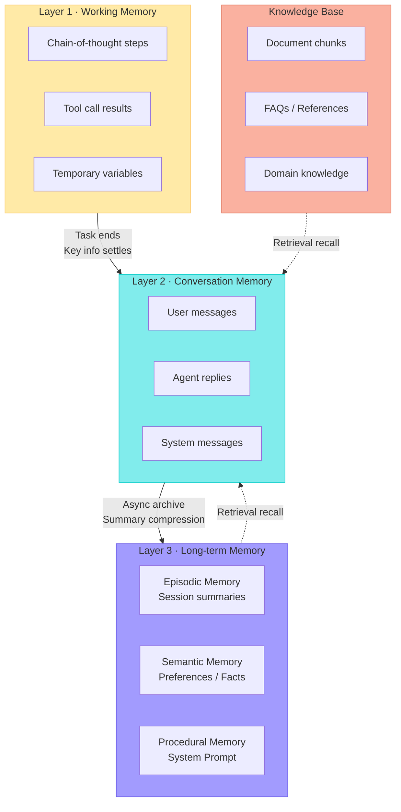
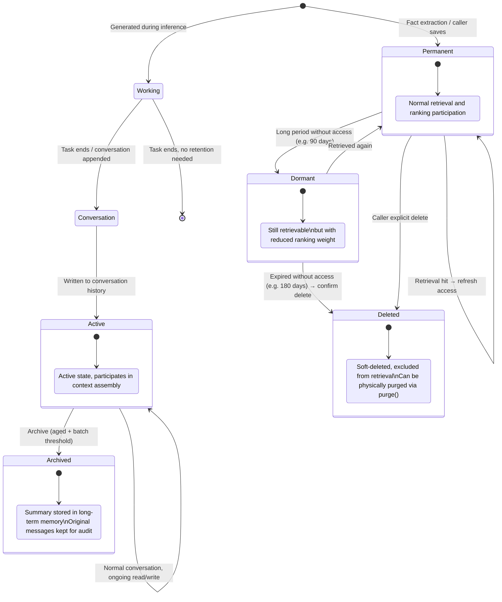
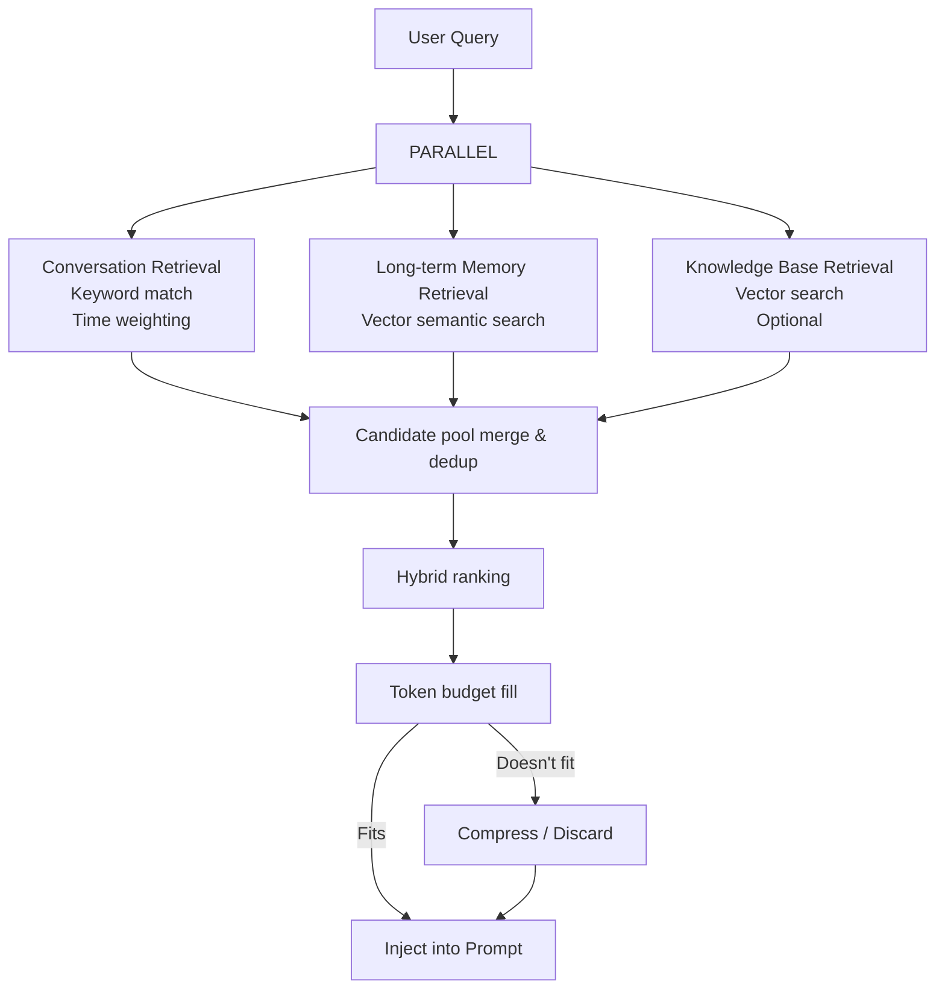

# Agent Memory System — General Design

## 1. Introduction

### 1.1 Why Agents Need Memory

Large Language Models (LLMs) are inherently stateless — each request is a fresh inference with no recollection of previous conversations. An Agent without a memory system:

- **Cannot maintain context**: When the user says "that plan we discussed" in turn 3, the Agent has no idea what it refers to.
- **Cannot accumulate knowledge**: Asked the same question repeatedly, the Agent starts from scratch every time.
- **Cannot personalize**: Unaware of user preferences, habits, and past decisions.

The core value of a memory system is to give Agents **continuity** and **personalization** — making them behave like experienced assistants rather than strangers meeting for the first time.

### 1.2 Library Positioning

`agent-memory` is a **TypeScript library** designed for Agent developers to integrate via `npm install`. Callers create an instance through the factory function `createMemory()`. All configuration is optional with sensible defaults.

**Core Characteristics**:

- **Embedded storage**: Built-in SQLite + local vector index, zero external dependencies
- **Single-directory deployment**: All data for an Agent instance lives in one directory — copy to migrate
- **LLM-agnostic**: The library never calls any LLM API; LLM capabilities are injected by the caller
- **Embedding-agnostic**: Ships with a built-in local embedding model; also supports custom injection (OpenAI / Cohere, etc.)
- **CLI support**: Built-in `agent-memory` command-line tool for code-free memory operations

### 1.3 Design Goals

| Goal | Description |
|------|-------------|
| **Zero-config startup** | `createMemory()` works out of the box; all config has reasonable defaults |
| **Type safety** | Complete TypeScript type definitions with autocomplete and compile-time checks |
| **Transparency** | Agents don't need to know about the underlying database or vector storage — just use the unified interface |
| **Instance isolation** | Each Agent owns an independent memory instance; multi-Agent setups naturally isolate |
| **Economy** | Memories are not dumped wholesale into the context window — they're retrieved by relevance and trimmed by token budget |
| **Natural forgetting** | Unused memories gradually lose weight and eventually get cleaned up, simulating human forgetting curves |
| **Auditability** | Every write, access, and deletion is traceable |
| **Extensibility** | Storage backends and embedding providers are swappable via interface injection |

---

## 2. Memory Taxonomy: Human Memory → Agent Memory

The Agent memory system draws inspiration from cognitive science's classification of human memory. Understanding this mapping helps drive correct architectural decisions.

### 2.1 Human Memory Model

```
┌─────────────────────────────────────────────────────────┐
│                    Human Memory System                   │
├──────────────┬──────────────────────────────────────────┤
│  Sensory     │ Milliseconds, auto-fading. Visual        │
│  Memory      │ persistence, auditory echo               │
├──────────────┼──────────────────────────────────────────┤
│  Working     │ Seconds to minutes, capacity 7±2 items.  │
│  Memory      │ Currently active information.            │
│  (Short-term)│ Lost without rehearsal                   │
├──────────────┼──────────────────────────────────────────┤
│              │ ┌─ Episodic: specific events (yesterday's │
│  Long-term   │ │  meeting)                              │
│  Memory      │ ├─ Semantic: conceptual knowledge        │
│              │ │  (Python is a programming language)     │
│              │ └─ Procedural: skills (riding a bicycle) │
└──────────────┴──────────────────────────────────────────┘
```

### 2.2 Agent Memory Mapping

| Human Memory | Agent Equivalent | Characteristics |
|-------------|-----------------|-----------------|
| Sensory memory | **No direct equivalent** | LLMs don't need sensory buffering |
| Working memory | **Working Memory** | Intermediate variables, tool results, chain-of-thought during a single inference |
| Short-term memory | **Conversation Memory** | Current session's message history, sliding window management |
| Episodic memory | **Episodic Memory** | Specific events: session summaries, decision processes |
| Semantic memory | **Semantic Memory** | Abstract knowledge: user preferences, facts, project information |
| Procedural memory | **Procedural Memory** | System prompt, tool usage patterns, fine-tuned weights |
| Prior knowledge | **Knowledge Base** | Pre-processed reference documents, FAQs, domain knowledge, loaded by developers |

> **Key Insight**: Human memory is a continuum; Agent memory shouldn't be a binary "have/don't have" either — it needs layers, transitions, and filtering mechanisms. The knowledge base maps to human "prior knowledge" — not learned from experience, but pre-acquired reference material.

---

## 3. Three-Layer Memory Architecture

Based on the above taxonomy, the Agent memory system uses a three-layer architecture, supplemented by a knowledge base as an external reference data source. Each layer has different storage media, lifecycles, and access patterns.



### 3.1 Layer 1: Working Memory

| Property | Value |
|----------|-------|
| Storage | Caller's process memory (RAM) |
| Lifecycle | Single task / single inference |
| Scope | Current execution context |
| Capacity | Limited by available memory |

**Contents**:

- `Thought → Action → Observation` sequences in ReAct / CoT reasoning chains
- Intermediate JSON results from tool calls
- Runtime computation state

**Design Points**:

- The library does not manage working memory — it's naturally managed by the Agent runtime
- Automatically released after task completion
- If a long-term-valuable conclusion is produced, the Agent should explicitly call `saveMemory()` to persist it to L3

### 3.2 Layer 2: Conversation Memory

| Property | Value |
|----------|-------|
| Storage | Embedded SQLite (default) |
| Lifecycle | Session-level, archived when aged |
| Scope | Current Agent instance's session |
| Capacity | Constrained by token budget |

**Contents**:

- Raw messages with `user` / `assistant` / `system` roles
- Token count per message
- Optional task association and attachment info

**Design Points**:

- Analogous to "what we just talked about" — the foundation for coherent conversations
- Uses a **sliding window** strategy; aged records are archived to L3

### 3.3 Layer 3: Long-term Memory

| Property | Value |
|----------|-------|
| Storage | Embedded SQLite + local vector index (default) |
| Lifecycle | Persists across sessions |
| Scope | Current Agent instance |
| Capacity | Governed by decay policy |

**Subtypes**:

| Subtype | Example Content | Write Method |
|---------|----------------|-------------|
| **Episodic** | "March 15 session discussed API refactoring" | Archive scheduler auto-generates summaries |
| **Semantic** | "User prefers Vim", "Project uses PostgreSQL" | Fact extractor / explicit caller save |
| **Procedural** | Agent's system prompt, behavioral patterns | Configured at initialization |

**Design Points**:

- Embedding vectors are generated synchronously on write — **write-then-index** is an atomic operation
- Each Agent instance owns its own long-term memory store, isolated from others
- Supports confidence scoring; high-confidence memories rank higher in retrieval

### 3.4 Knowledge Base

| Property | Value |
|----------|-------|
| Storage | Embedded SQLite + local vector index (default) |
| Lifecycle | Explicitly managed by caller, no decay |
| Scope | Current Agent instance |
| Capacity | No fixed upper limit |

**Contents**:

- Pre-processed document chunks (API docs, product manuals, FAQs, etc.)
- Managed by source group, supporting batch replacement

**Comparison with Long-term Memory**:

| Dimension | Long-term Memory | Knowledge Base |
|-----------|-----------------|----------------|
| Origin | Auto-extracted from conversations or explicitly saved | Pre-loaded by developer |
| Nature | Learned from experience | Pre-prepared reference material |
| Lifecycle | Decays, can be forgotten | No decay, explicit add/remove |
| Write timing | Dynamically generated at runtime | Batch-imported at init or update |
| Retrieval tag | `[preference]` `[fact]` `[summary]` | `[knowledge]` |

**Design Points**:

- Each knowledge chunk is vectorized on write, sharing the same vector index as long-term memory
- Grouped by `source` field; `removeKnowledgeBySource()` enables full source replacement
- Knowledge entries are not subject to decay; importance weight is fixed at baseline 0.8
- **Ref-only injection**: `assembleContext()` injects only title + excerpt (first 120 chars) + reference ID, not full text, to save token budget
- **On-demand full-text loading**: LLM uses the `knowledge_read(id)` tool to load complete content by reference ID — "browse first, dive in when needed"

---

## 4. Memory Lifecycle

A piece of information goes through a complete lifecycle from creation to disposal. Understanding this flow is key to understanding the system's design decisions.



### 4.1 Write Paths

| Trigger Event | Target Layer | Mechanism |
|---------------|-------------|-----------|
| `appendMessage()` appends user message | L2 Conversation | Real-time append, auto token count |
| `appendMessage()` appends Agent reply | L2 Conversation | Real-time append |
| Fact extractor detects preference/fact | L3 Long-term | Async extraction + vectorized write |
| Archive scheduler generates summary | L3 Long-term | Internal scheduling, LLM generates summary |
| Caller explicitly calls `saveMemory()` | L3 Long-term | Direct write |

### 4.2 Fact Extraction

Fact extraction is the memory system's core intelligence — automatically identifying information worth remembering long-term from conversations.

> **Prerequisite**: The LLM mode of fact extraction requires the caller to inject an `LLMProvider` when creating the instance. Without it, only rule-matching mode is used.

**Extraction Strategies**:

```
Input: One conversation turn (user message + Agent reply)
Output: Zero to many structured facts

Method 1: Rule matching (low latency, high precision, low recall)
  - "I like/prefer/am used to X" → preference
  - "Project uses/adopts X" → fact
  - "Don't use/avoid X" → preference

Method 2: LLM extraction (high latency, high recall, needs verification)
  - Send the conversation to the injected LLMProvider with a prompt requesting structured fact extraction
  - Suitable for complex, implicit information

Recommended: rule matching as primary, LLM as supplement
```

**Confidence Assessment**:

| Source | Confidence | Handling |
|--------|-----------|----------|
| Caller explicit save | 1.0 | Write directly |
| Rule high-confidence match | 0.8 | Write directly |
| Rule fuzzy match | 0.5 | Write but mark as needs confirmation |
| LLM extraction | 0.6 | Write but mark as needs confirmation |

### 4.3 Archive Strategy

The archive scheduler aims to compress stale conversation memories into refined long-term memories, freeing context window space.

> **Prerequisite**: Archive summarization requires an injected `LLMProvider`. Without LLM injection, archiving only marks status without generating summaries.

```
┌──────────────────────────────────────────────┐
│         Archive Scheduler Workflow            │
├──────────────────────────────────────────────┤
│                                              │
│  Triggers:                                   │
│  ├─ Auto-detected during assembleContext()   │
│  ├─ Manually via runMaintenance()            │
│  └─ Requires: N minutes of silence           │
│                                              │
│  1. Select candidates                        │
│     └─ Active conversation records older     │
│        than the time window                  │
│     └─ Candidate count must exceed min batch │
│                                              │
│  2. Batch processing (with max batch limit)  │
│     ├─ Concatenate message text              │
│     ├─ Call LLMProvider to generate 3-5      │
│     │   sentence summary                     │
│     └─ Write to long-term memory (episodic)  │
│                                              │
│  3. Mark original records as archived        │
│     └─ Preserve association pointer for      │
│        traceability                          │
└──────────────────────────────────────────────┘
```

**Reference Parameters** (all configurable via `MemoryConfig`):

| Parameter | Config Key | Default | Description |
|-----------|-----------|---------|-------------|
| Silence detection | `archive.quietMinutes` | 5 min without new messages | Avoid interrupting active conversations |
| Time window | `archive.windowHours` | 24 hours | Only archive records older than this |
| Min batch | `archive.minBatch` | 5 messages | Too few isn't worth archiving |
| Max batch | `archive.maxBatch` | 20 messages | Single archive batch limit, controls LLM call cost |

### 4.4 Decay and Forgetting

Simulates human forgetting curves — memories not accessed for a long time gradually lose weight:

| Stage | Condition | Effect |
|-------|-----------|--------|
| **Active** | Recently accessed | Normal retrieval participation, normal ranking weight |
| **Dormant** | Created over decay period (e.g. 90 days) ago with no access | Still retrievable, but with reduced ranking weight |
| **Candidate for cleanup** | Dormant state persists beyond expiry period (e.g. 180 days) | Triggers `onDecayWarning` callback to notify caller |
| **Deleted** | Caller explicit delete | Soft-deleted (marked invisible), physically removable via `purge()` |

> **Why soft delete?** Prevents irreversible data loss from accidental operations. Soft-deleted memories are excluded from all retrieval but can be restored when needed.

---

## 5. Retrieval and Context Assembly

The ultimate value of memory lies in "use" — retrieving relevant memories and injecting them into the LLM's context. This is the most critical part of the entire system.

### 5.1 Core Challenge

```
Context window (e.g. 128K tokens) is finite:
  System Prompt:   ~2K tokens (must reserve)
  User input:      ~1K tokens (must reserve)
  Output reserve:  ~1K tokens (must reserve)
  ─────────────────────────────
  Memory budget:   ~124K tokens (seems like a lot)

But in practice:
  Active conversations:    may have 500 messages
  Long-term memories:      may have thousands of facts
  Knowledge base docs:     may have tens of thousands of chunks

  ⇒ Can't fit everything. Must retrieve + trim.
```

### 5.2 Hybrid Retrieval Strategy



**Stage Details**:

#### Stage 1: Parallel Retrieval

| Data Source | Retrieval Method | Injection Method |
|-------------|-----------------|-----------------|
| Conversation memory | Keyword match + time weight | Original text fragments |
| Long-term memory | Vector cosine similarity | Original text |
| Knowledge base | Vector cosine similarity | **Title + excerpt + reference ID only**; LLM loads full text on demand via `knowledge_read` tool |

#### Stage 2: Hybrid Ranking

```
Ranking function = f(relevance, recency, importance)

Where:
  relevance  = vector similarity or keyword match score (0-1)
  recency    = time decay factor (more recent = higher)
  importance = memory importance weight (confidence × access frequency)

Ranking rules:
  1. When relevance difference > threshold (e.g. 0.05), sort by relevance descending
  2. When relevance is similar, sort by recency descending
  3. All else equal, sort by importance descending
```

#### Stage 3: Token Budget Filling

```
Available budget = model context window - (System Prompt + user input + output reserve)

Fill strategy (greedy):
  Try to fit each item in ranking order
   ├─ Fits → add directly
   ├─ Doesn't fit but has summary version → use summary instead
   ├─ Doesn't fit and is long text → real-time LLM compression then retry
   └─ Still doesn't fit → skip
```

### 5.3 Injection Format

Retrieved memories are injected into the Prompt in a structured format so the LLM understands each item's nature and origin:

```
<MEMORY>
[conversation] 2 hours ago user mentioned needing to improve error handling
[preference] Prefers TypeScript + React tech stack
[fact] Project Alpha uses PostgreSQL + gRPC
[summary] March discussion conclusion: API adopts RESTful style
[knowledge·api-docs] Authentication — All API requests require Bearer Token… (ref:kb_1711929600_a3f)
[knowledge·api-docs] Rate Limiting — Each API Key limited to 1000 req/min… (ref:kb_1711929601_b4e)
[compressed] (original too long, compressed) Last week reviewed monitoring plan, decided on Prometheus
</MEMORY>
```

> **Knowledge base ref-only injection**: Full text is not passed to the LLM. Only title + excerpt (first 120 chars) + reference ID are injected. The LLM can load full content via the `knowledge_read(id)` tool on demand. This saves context window while letting the LLM know what knowledge is available.

**Tag Conventions**:

| Tag | Source | Description |
|-----|--------|-------------|
| `[conversation]` | L2 Conversation memory | Active message text fragments |
| `[preference]` / `[fact]` / `[project]` | L3 Semantic memory | Annotated with specific category |
| `[summary]` | L3 Episodic memory | Archive-generated session summary |
| `[knowledge·{source}]` | Knowledge base | Title + excerpt + reference ID; `ref:kb_xxx` can be loaded via `knowledge_read` |
| `[compressed]` | Any source | Content compressed in real-time due to budget constraints |

---

## 6. Instance Model: One Agent, One Memory

The memory system is designed for a **single Agent**. Each Agent owns an independent memory instance containing complete conversation and long-term memory storage.

### 6.1 Core Principle

```
┌─────────────────────────────────────────────────────┐
│           Single Agent Memory Instance               │
├─────────────────────────────────────────────────────┤
│                                                     │
│  ┌───────────────────────────────────────────┐       │
│  │  Layer 2: Conversation Memory              │       │
│  │  (This Agent's conversation history)       │       │
│  └───────────────────────────────────────────┘       │
│                                                     │
│  ┌───────────────────────────────────────────┐       │
│  │  Layer 3: Long-term Memory                 │       │
│  │  Preferences / Facts / Summaries /         │       │
│  │  Procedural Memory                         │       │
│  └───────────────────────────────────────────┘       │
│                                                     │
│  ┌───────────────────────────────────────────┐       │
│  │  Knowledge Base                            │       │
│  │  Pre-loaded doc chunks / FAQ / Domain      │       │
│  └───────────────────────────────────────────┘       │
│                                                     │
│  ┌───────────────────────────────────────────┐       │
│  │  Vector Index                              │       │
│  │  (Long-term memory + KB shared)            │       │
│  └───────────────────────────────────────────┘       │
│                                                     │
└─────────────────────────────────────────────────────┘
```

### 6.2 Multi-Agent Scenario

When an application has multiple Agents, each creates its own memory instance, achieving physical isolation through different `dataDir` paths.

```
Agent A  ──→  createMemory({ dataDir: './data/agent-a' })  ──→  Independent data dir A
Agent B  ──→  createMemory({ dataDir: './data/agent-b' })  ──→  Independent data dir B
Agent C  ──→  createMemory({ dataDir: './data/agent-c' })  ──→  Independent data dir C
```

**Isolation Approaches**:

| Approach | Description | Use Case |
|----------|-------------|----------|
| **Independent data directory** (default) | Each instance uses separate SQLite files and vector index directories | Strong isolation, simplest |
| **Custom StorageProvider** | Implement the storage interface with your own isolation strategy | Advanced scenarios |

> **Recommended**: Use independent database files for the most thorough isolation — no risk of query filter omissions.

### 6.3 Inter-Agent Communication

Since each Agent's memory is completely independent, Agents cannot directly read each other's memories. Information transfer is coordinated by the host application:

| Scenario | Mechanism |
|----------|-----------|
| Agent A's conclusion needs to reach Agent B | Host app takes A's output as B's input via `appendMessage()` |
| Multiple Agents need shared facts | Host app writes the same initial facts to each via `saveMemory()` at creation time |
| Collaboration | Host app maintains a shared message bus; Agents communicate through it rather than accessing each other's memory |

> **Principle**: The memory library handles its own business. Cross-Agent coordination is the host application's responsibility.

---

## 7. Unified Memory Interface

All Agents operate memory through a unified interface — **direct storage access bypassing the interface is prohibited**. This is the foundation for audit and consistency.

### 7.1 Initialization Config (MemoryConfig)

Behavior is controlled via a config object when creating an instance. All fields are optional with sensible defaults:

| Config Key | Type | Default | Description |
|-----------|------|---------|-------------|
| `dataDir` | string | `process.env.AGENT_MEMORY_DATA_DIR \|\| './memoryData'` | Data storage directory. Reads env var `AGENT_MEMORY_DATA_DIR` first, falls back to `'./memoryData'` |
| `embedding` | EmbeddingProvider | Built-in local model | Embedding provider interface |
| `llm` | LLMProvider | None (disables summarization/extraction) | LLM provider for archive summaries and fact extraction |
| `tokenBudget.contextWindow` | integer | 128000 | Model context window size |
| `tokenBudget.systemPromptReserve` | integer | 2000 | Tokens reserved for system prompt |
| `tokenBudget.outputReserve` | integer | 1000 | Tokens reserved for LLM output |
| `archive.quietMinutes` | integer | 5 | Silence period (minutes) before archiving |
| `archive.windowHours` | integer | 24 | Only archive records older than this |
| `archive.minBatch` | integer | 5 | Minimum archive batch size |
| `archive.maxBatch` | integer | 20 | Maximum archive batch size |
| `decay.dormantAfterDays` | integer | 90 | Days until dormancy |
| `decay.expireAfterDays` | integer | 180 | Days until candidate for cleanup |
| `limits.maxConversationMessages` | integer | 500 | Max active conversation messages |
| `limits.maxLongTermMemories` | integer | 1000 | Max long-term memory items |

### 7.2 External Provider Interfaces

The library accepts two optional external capability injections:

**EmbeddingProvider** (vector embedding):

| Property/Method | Description |
|----------------|-------------|
| `dimensions` | Vector dimensionality (e.g. 384 / 768 / 1536) |
| `embed(text) → number[]` | Convert text to an embedding vector |

**LLMProvider** (LLM calls for archive summarization and fact extraction):

| Property/Method | Description |
|----------------|-------------|
| `generate(prompt) → string` | Given a prompt, return LLM-generated text |

> Without `EmbeddingProvider`, the library uses a built-in local model. Without `LLMProvider`, archiving only marks status (no summaries), and fact extraction uses only rule matching.

### 7.3 Core Data Types

**Message** (conversation message):

| Field | Type | Description |
|-------|------|-------------|
| `id` | integer | Auto-increment primary key |
| `role` | `'user'` / `'assistant'` / `'system'` | Role |
| `content` | string | Message content |
| `tokenCount` | integer | Token count |
| `metadata` | key-value map (optional) | Extension metadata |
| `createdAt` | Unix ms timestamp | Creation time |

**MemoryItem** (long-term memory entry):

| Field | Type | Description |
|-------|------|-------------|
| `id` | string | e.g. `ltm_{timestamp}_{random}` |
| `category` | `'preference'` / `'fact'` / `'episodic'` / `'procedural'` | Memory category |
| `key` | string | Title / index key |
| `value` | string | Memory content |
| `confidence` | float 0-1 | Confidence score |
| `accessCount` | integer | Access count |
| `lastAccessed` | Unix ms timestamp (nullable) | Last access time |
| `isActive` | boolean | Whether active (soft-delete flag) |
| `createdAt` | Unix ms timestamp | Creation time |

**AssembledContext** (assembled context):

| Field | Type | Description |
|-------|------|-------------|
| `text` | string | Formatted text ready for prompt injection |
| `tokenCount` | integer | Tokens used |
| `sources` | source array | Retrieved source entries (type: `'conversation'` / `'memory'` / `'knowledge'`, ID, relevance score) for debugging/audit |

**KnowledgeChunk** (knowledge base entry):

| Field | Type | Description |
|-------|------|-------------|
| `id` | string | e.g. `kb_{timestamp}_{random}` |
| `source` | string | Source identifier (e.g. `'api-docs'`, `'faq'`) |
| `title` | string | Title |
| `content` | string | Content body |
| `tokenCount` | integer | Token count |
| `metadata` | key-value map (optional) | Extension metadata |
| `createdAt` | Unix ms timestamp | Creation time |

### 7.4 Main Interface Methods

#### Read

| Method | Returns | Description |
|--------|---------|-------------|
| `getConversationHistory(limit?)` | Message list | Get recent active (non-archived) conversation memory, chronological order |
| `searchMemory(query, topK?)` | Scored MemoryItem list | Semantic search in long-term memory; automatically refreshes hit memory's access time |
| `assembleContext(query, tokenBudget?)` | AssembledContext | One-stop context assembly: parallel retrieval (conversation + LTM + KB) → ranking → budget trimming → formatting. Optional `tokenBudget` overrides per-call. Auto-detects whether archiving is needed |

#### Write

| Method | Returns | Description |
|--------|---------|-------------|
| `appendMessage(role, content, metadata?)` | message ID | Append a conversation message, auto-computes token count |
| `saveMemory(category, key, value, confidence?)` | memory ID | Write to long-term memory. Atomic: generate ID → write DB → generate embedding → write vector index |

#### Knowledge Base

| Method | Returns | Description |
|--------|---------|-------------|
| `addKnowledge(source, title, content, metadata?)` | chunk ID | Add a knowledge chunk, vectorized on write |
| `addKnowledgeBatch(chunks)` | ID array | Batch add knowledge chunks |
| `removeKnowledge(id)` | void | Delete a single knowledge chunk (physical delete) |
| `removeKnowledgeBySource(source)` | delete count | Delete all chunks from a source, for batch updates |
| `listKnowledge(source?)` | KnowledgeChunk list | List knowledge chunks, filterable by source |
| `searchKnowledge(query, topK?)` | Scored KnowledgeChunk list | Semantic search in knowledge base |

#### Management

| Method | Returns | Description |
|--------|---------|-------------|
| `deleteMemory(id)` | void | Soft-delete: mark invisible + clear vector, no physical deletion |
| `listMemories(filter?)` | MemoryItem list | List memory entries with category, status, time range filters |
| `refreshAccess(id)` | void | Increment access count, update last access time to now |

#### Configuration

| Method | Returns | Description |
|--------|---------|-------------|
| `updateTokenBudget(budget)` | void | Dynamically update token budget config (partial update), effective on next `assembleContext()` call |

#### LLM Tool Integration

| Method | Returns | Description |
|--------|---------|-------------|
| `getToolDefinitions(format)` | tool definition array | Get Function/Tool definitions for memory tools; supports `'openai'` / `'anthropic'` / `'langchain'` formats |
| `executeTool(name, args)` | execution result | Execute a memory tool call in the Agent's tool call handler |

#### Operations

| Method | Returns | Description |
|--------|---------|-------------|
| `getStats()` | MemoryStats | Memory count statistics, storage size |
| `listConversations(offset?, limit?)` | Message list | Paginated conversation history query (including archived) |
| `runMaintenance()` | MaintenanceResult | Manual archive + decay detection trigger (also lazy-triggered by `assembleContext()`) |
| `export()` | JSON data | Export all memory data |
| `import(data)` | void | Restore memory from exported data |
| `purge()` | purge count | Physically delete all soft-deleted memories (irreversible) |
| `close()` | void | Release SQLite connections and vector index resources. No methods can be called after closing |

### 7.5 Interface Behavior Conventions

| Method | Key Behavior |
|--------|-------------|
| `getConversationHistory` | Returns only active (non-archived) records, in chronological order |
| `searchMemory` | Vector semantic search in the current instance's long-term memory; auto-refreshes hit memory's access time |
| `assembleContext` | Parallel conversation retrieval + LTM retrieval + KB retrieval → hybrid ranking → token budget trimming → return prompt-ready text. Supports optional `tokenBudget` parameter; unspecified fields fall back to instance-level config |
| `appendMessage` | Auto-computes `tokenCount`; optional task ID and attachment association |
| `saveMemory` | Atomic operation: generate ID → write SQLite → generate embedding → write vector index |
| `deleteMemory` | Soft-delete: mark invisible + clear corresponding vector, no physical deletion |
| `close` | Any method call after closing throws `MemoryClosedError` |

**Error Type Hierarchy**:

| Error Type | Trigger |
|-----------|---------|
| `MemoryError` | Base class for all memory operation errors |
| `MemoryClosedError` | Method called after instance is closed |
| `MemoryNotFoundError` | Operated memory ID does not exist |
| `MemoryCapacityError` | Capacity limit exceeded |
| `EmbeddingError` | Embedding vector generation failed |

### 7.6 Agent Integration Flow

Typical flow for an Agent executing a task:

```
① assembleContext(user input)
   → Three-way parallel retrieval (conversation + LTM + KB)
   → Hybrid ranking → token budget trimming → format as context text
   (Optional: pass tokenBudget to override per-call budget config)

② Build Prompt = System Prompt + memory context + user input
   → Call LLM to generate reply

③ appendMessage('assistant', reply content)
   → Store reply in conversation memory

④ (Async) fact extractor analyzes current turn
   → If preferences/facts found, calls saveMemory() to persist to LTM

⑤ If LLM returns tool calls (memory tools), execute via executeTool()
```

---

## 8. Storage Model (Internal Implementation)

> The following describes the library's internal storage structure. Callers don't need to know this — it's provided for understanding implementation and debugging.

### 8.1 Data Directory Structure

```
{dataDir}/
├── memory.db          # SQLite database (conversations + LTM + knowledge)
├── vectors/           # Local vector index files
│   ├── index.bin      # HNSW index (LTM + KB shared)
│   └── meta.json      # ID mapping metadata
└── audit.log          # Audit log
```

### 8.2 Conversations Table

| Field | Type | Description |
|-------|------|-------------|
| `id` | auto-increment integer | Primary key |
| `role` | string | `'user'` / `'assistant'` / `'system'` |
| `content` | string | Message content |
| `token_count` | integer | Token count |
| `attachments` | JSON (nullable) | Attachment descriptions |
| `related_task_id` | string (nullable) | Associated task ID |
| `metadata` | JSON (nullable) | Extension metadata |
| `summary` | string (nullable) | Summary generated during archiving |
| `importance` | float | Importance weight, default 0.5 |
| `is_archived` | boolean | 0=active, 1=archived |
| `ltm_ref_id` | string (nullable) | ID pointing to long-term memory after archiving |
| `created_at` | Unix ms timestamp | Creation time |

Index: `(is_archived, created_at)` composite index for fast active-record time-ordered queries.

### 8.3 Long-term Memories Table

| Field | Type | Description |
|-------|------|-------------|
| `id` | string | Primary key, e.g. `ltm_{timestamp}_{random}` |
| `category` | string | `'preference'` / `'fact'` / `'episodic'` / `'procedural'` |
| `key` | string | Title / index key |
| `value` | string | Memory content |
| `embedding_id` | string | ID in the vector index |
| `confidence` | float | 0-1 confidence, default 0.7 |
| `access_count` | integer | Access count, default 0 |
| `last_accessed` | Unix ms timestamp (nullable) | Last access time |
| `is_active` | boolean | 1=active, 0=soft-deleted |
| `created_at` | Unix ms timestamp | Creation time |

Index: `(is_active)` index for fast active-memory queries.

### 8.4 Knowledge Chunks Table

| Field | Type | Description |
|-------|------|-------------|
| `id` | string | Primary key, e.g. `kb_{timestamp}_{random}` |
| `source` | string | Source identifier (e.g. `'api-docs'`, `'faq'`) |
| `title` | string | Title |
| `content` | string | Content body |
| `embedding_id` | string | ID in the vector index |
| `token_count` | integer | Token count |
| `metadata` | JSON (nullable) | Extension metadata |
| `created_at` | Unix ms timestamp | Creation time |

Index: `(source)` index for fast source-based queries and batch deletion.

### 8.5 Vector Index

| Field | Type | Description |
|-------|------|-------------|
| `vector` | `Float32[dim]` | Embedding vector (dimension depends on EmbeddingProvider, e.g. 384 / 768 / 1536) |
| `text` | `String` | Original text or summary |
| `metadata.source_type` | `String` | `'memory'` / `'knowledge'` / `'episodic'` |
| `metadata.category` | `String` | Memory category |
| `metadata.source_id` | `String` | Associated `long_term_memory.id` |
| `metadata.created_at` | `Int64` | Creation timestamp |

> The library defaults to an embedded HNSW vector index (via [hnswlib-node](https://github.com/yoshoku/hnswlib-node)), requiring no external vector database. Each instance has its own independent index file.

---

## 9. Embedding Provider

### 9.1 Interface Design

The EmbeddingProvider interface has two capabilities:

| Property/Method | Description |
|----------------|-------------|
| `dimensions` | Vector dimensionality (e.g. 384 / 768 / 1536) |
| `embed(text) → number[]` | Convert text to an embedding vector |

### 9.2 Built-in Default Implementation

If the caller doesn't inject an `EmbeddingProvider`, the library uses a local model (via `@xenova/transformers`, ONNX Runtime inference):

- **Model**: `all-MiniLM-L6-v2` (384 dimensions, ~80MB)
- **Advantages**: No API key needed, no network requests, fully local data
- **First use**: Auto-downloads model to `{dataDir}/models/`, cached thereafter

### 9.3 Custom Injection

Callers can inject any object implementing the EmbeddingProvider interface, including but not limited to:

| Provider | Typical Dimensions | Description |
|----------|-------------------|-------------|
| OpenAI (`text-embedding-3-small`) | 1536 | Calls OpenAI Embeddings API |
| Cohere (`embed-english-v3.0`) | 1024 | Calls Cohere Embed API |
| Ollama (`nomic-embed-text`) | 768 | Local Ollama instance |
| Other custom models | Custom | Any implementation returning fixed-dimension vectors |

---

## 10. LLM Tool Definition Export

When Agents use Function Calling / Tool Use mode, the memory library can export memory operations as tools, letting the LLM proactively manage its own memory during conversations.

### 10.1 Tool Inventory

| Tool Name | Parameters | Purpose | Permission |
|-----------|-----------|---------|-----------|
| `memory_search` | `{ query, topK? }` | Semantic search in long-term memory | Auto |
| `memory_save` | `{ category, key, value }` | Save fact/preference to long-term memory | Auto |
| `memory_list` | `{ category? }` | List active memory entries | Auto |
| `memory_delete` | `{ id }` | Soft-delete a memory | Needs confirmation |
| `memory_get_history` | `{ limit? }` | Get recent N conversation messages | Auto |
| `knowledge_read` | `{ id }` | Read full text of a knowledge chunk by reference ID. Called when context contains `ref:kb_xxx` references and the LLM needs detailed content | Auto |
| `knowledge_search` | `{ query, topK? }` | Semantic search in knowledge base; returns title + excerpt + reference ID (no full text) | Auto |

### 10.2 Tool Export Mechanism

The library exports tool definitions via `getToolDefinitions(format)`, returning formats directly usable by the corresponding LLM SDK. Call `executeTool(name, args)` to execute in the Agent's tool call handler.

Supported export formats:

| Format | Compatible SDK |
|--------|---------------|
| `'openai'` | OpenAI SDK / Vercel AI SDK |
| `'anthropic'` | Anthropic SDK |
| `'langchain'` | LangChain / LangGraph |

### 10.3 Security Conventions

| Convention | Description |
|-----------|-------------|
| **Instance-bound** | Tools operate on the current Agent instance's own memory; LLM cannot specify a target |
| **Delete requires confirmation** | `memory_delete`'s `executeTool` returns a confirmation prompt by default rather than deleting directly; caller can configure to skip confirmation |
| **Write content sanitization** | Filters special control characters on write, truncates overly long content, intercepts sensitive information (passwords/keys) |
| **Audit logging** | All write and delete operations are logged to the local audit log file |

---

## 11. Security Design

| Threat Type | Attack Scenario | Defense Measures |
|------------|----------------|-----------------|
| **Memory Poisoning (Prompt Injection)** | Attacker injects malicious instructions via conversation, stored in long-term memory | Pre-write text sanitization: strip control markers, filter suspicious instruction patterns |
| **Sensitive Information Leakage** | API keys / passwords mentioned in conversation inadvertently stored in memory | Fact extraction pipeline configured with sensitive info regex interception; matched content triggers alert but is not stored |
| **Memory Tampering** | LLM tricked into calling `memory_save` to overwrite critical facts | Important facts gain `immutable` flag; override operations require user confirmation |
| **Storage Bloat** | Massive writes causing disk usage growth | Memory count limits (`limits.maxConversationMessages` / `limits.maxLongTermMemories`), storage capacity monitoring alerts |
| **Accidental Deletion** | Agent or caller accidentally deletes critical memories | Soft-delete only; physical deletion requires explicit `purge()` call |
| **Audit Requirements** | Need to track when what was written/deleted | All mutation operations logged to audit log: timestamp, operation type, content summary |

---

## 12. Capacity Monitoring and Operations

### 12.1 Capacity Monitoring

The library exposes statistics via `getStats()` (including memory counts, storage sizes); callers can check on demand.

**Statistics Include**:

| Metric Group | Fields | Description |
|-------------|--------|-------------|
| Conversation memory | Active / Archived count | Counts of non-archived and archived messages |
| Long-term memory | Active / Dormant / Deleted count | Memory counts by status |
| Knowledge base | Chunk count / Source count | Total chunks and distinct source count |
| Storage size | SQLite bytes / Vector index bytes | Disk usage |

**Recommended Monitoring Thresholds**:

| Metric | Suggested Threshold | Action |
|--------|-------------------|--------|
| Active conversation message count | > 500 | Call `runMaintenance()` to trigger archiving |
| Long-term memory count | > 1000 | Call `listMemories()` to clean up low-frequency entries |
| Vector index size | > 1 GB | Call `purge()` to clean up deleted vectors |
| Dormant memory count | > 100 | Clean up expired entries |

### 12.2 Maintenance Operations

| Operation | Method | Description |
|-----------|--------|-------------|
| Manual archive + decay detection | `runMaintenance()` | Returns archive count, dormant count, summaries generated |
| Export all data | `export()` | JSON format for backup/migration |
| Restore from backup | `import(data)` | Restore memory from exported data |
| Physically purge soft-deleted memories | `purge()` | Irreversible operation, returns purge count |
| Graceful shutdown | `close()` | Release SQLite connections and vector index resources |

---

## 13. Command-Line Tool (CLI)

The library includes a built-in command-line tool `agent-memory`. After installation, it can operate the memory system directly from the terminal without writing code. Suitable for debugging, data management, and quick verification.

### 13.1 Installation and Usage

```bash
# Global install
npm install -g agent-memory

# Or run directly via npx
npx agent-memory <command>
```

### 13.2 Global Options

| Option | Description |
|--------|-------------|
| `--data-dir <path>` | Specify data directory. Priority: `--data-dir` > `$AGENT_MEMORY_DATA_DIR` > `./memoryData` |

### 13.3 Command Reference

#### Conversation Memory

| Command | Description | Example |
|---------|-------------|---------|
| `append <role> <content>` | Append message (role: user/assistant/system) | `agent-memory append user "Hello"` |
| `history [--limit N]` | View recent conversation history | `agent-memory history --limit 10` |

#### Long-term Memory

| Command | Description | Example |
|---------|-------------|---------|
| `save <category> <key> <value>` | Save memory (optional `--confidence`) | `agent-memory save preference lang TypeScript` |
| `search <query> [--top-k N]` | Semantic search long-term memory | `agent-memory search "user preferences"` |
| `list [--category <cat>]` | List memory entries | `agent-memory list --category fact` |
| `delete <id>` | Soft-delete a memory | `agent-memory delete ltm_xxx` |

#### Knowledge Base

| Command | Description | Example |
|---------|-------------|---------|
| `kb-add --source <s> --title <t> [--file <path>] [content]` | Add knowledge chunk | `agent-memory kb-add --source api --title Auth --file auth.md` |
| `kb-list [--source <s>]` | List knowledge chunks | `agent-memory kb-list --source api` |
| `kb-search <query> [--top-k N]` | Search knowledge base | `agent-memory kb-search "authentication"` |
| `kb-remove <id>` or `--source <s>` | Remove chunk or batch remove | `agent-memory kb-remove --source api` |

#### Context Assembly

| Command | Description | Example |
|---------|-------------|---------|
| `context <query>` | Three-way retrieval + ranking + budget trimming; outputs prompt-injectable text | `agent-memory context "project architecture"` |

#### Operations

| Command | Description | Example |
|---------|-------------|---------|
| `stats` | View memory statistics | `agent-memory stats` |
| `maintenance` | Manual archive + decay detection | `agent-memory maintenance` |
| `export [--output <file>]` | Export all data as JSON | `agent-memory export --output backup.json` |
| `import <file>` | Restore data from JSON file | `agent-memory import backup.json` |
| `purge` | Physically delete soft-deleted memories (interactive confirm) | `agent-memory purge` |

---

## 14. Design Decisions and Trade-offs

| Decision | Choice | Alternative | Rationale |
|----------|--------|-------------|-----------|
| **Library, not service** | ✅ npm package, embedded use | Standalone microservice + HTTP API | Zero deployment cost, zero ops; Agent devs just `npm install` |
| **Embedded storage** | ✅ SQLite + local vector index | PostgreSQL + Milvus, etc. | Zero external dependencies, single-directory deployment, copy to migrate |
| **Factory function** | ✅ `createMemory()` | Class constructor `new Memory()` | Hides internal implementation, async init is more natural, easier to swap internals |
| **All-async API** | ✅ All methods return Promise | Provide sync versions | I/O operations are naturally async; unified style avoids confusion |
| **LLM-agnostic** | ✅ Via `LLMProvider` injection | Built-in OpenAI calls | Maintains library generality; caller controls LLM choice and cost |
| Single-instance model | ✅ | Shared storage + agent_id isolation | Simple, thorough isolation, no filter omission risk |
| Write-then-index | ✅ | Async batch vectorization | Avoids querying un-indexed memories; guarantees consistency |
| Soft-delete first | ✅ | Direct physical deletion | Safety first, accidental deletes are recoverable. `purge()` provides explicit physical deletion |
| Rule + LLM dual extraction | ✅ | Pure LLM extraction | Rule matching is fast and reliable; LLM extraction supplements |
| Hybrid retrieval (keyword + vector) | ✅ | Pure vector retrieval | Keyword matching in conversation memory is sometimes more precise than semantic search |
| Token budget greedy fill | ✅ | Optimal knapsack algorithm | Greedy is simple and efficient; practical difference is negligible |
| Progressive decay vs. periodic cleanup | ✅ | Fixed expiration time | Simulates natural forgetting; frequently used memories aren't accidentally cleaned |
| **Knowledge base separate from memory** | ✅ Independent table + shared vector index | Store in long-term memory | Knowledge is static reference data, no decay/confidence needed; independent management supports batch replacement |
| **Dynamic token budget** | ✅ `updateTokenBudget()` + per-call override | Config only at init | Different models/scenarios need different budgets; runtime switching is more flexible |

---

## 15. Summary

The essence of `agent-memory` is building **stateful continuity** on top of LLM's stateless inference, packaged as a ready-to-use TypeScript library. Core design principles can be summarized as:

1. **Zero-config startup**: `npm install` + `createMemory()` is all you need; all configuration is optional
2. **Three-layer separation**: Working memory (transient) → Conversation memory (session-level) → Long-term memory (persistent), each with independent lifecycle and management strategies
3. **Knowledge base support**: Built-in knowledge base as pre-processed reference data source, complementing dynamic memories; grouped by source, batch-replaceable
4. **Single-instance model**: One Agent, one memory instance; multi-Agent setups create independent instances with thorough isolation and simple implementation
5. **Write-then-index**: Storage and vectorization are atomic; no "stored but not indexed" intermediate state
6. **Three-way retrieval**: Conversation (keyword) + long-term memory (vector) + knowledge base (vector) in parallel, hybrid ranked then trimmed by token budget
7. **Dynamic budget**: Token budget supports instance-level updates and per-call overrides, adapting to different models and scenarios
8. **Natural forgetting**: Outdated memories don't suddenly disappear but gradually lose weight and eventually get cleaned up (knowledge base is exempt from decay)
9. **Dependency-free**: Not bound to any specific LLM or embedding provider; stays universal through interface injection
10. **Defense in depth**: Content sanitization + audit logging + soft deletion — multiple layers of protection
11. **CLI tool**: Built-in `agent-memory` command line for code-free memory system operation, convenient for debugging and data management
