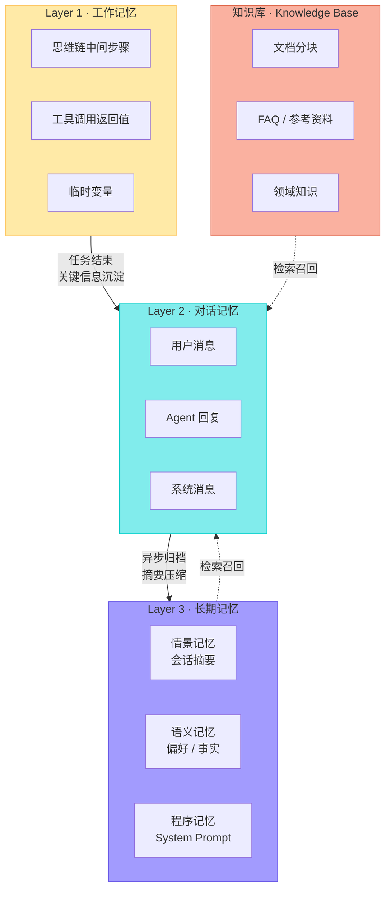
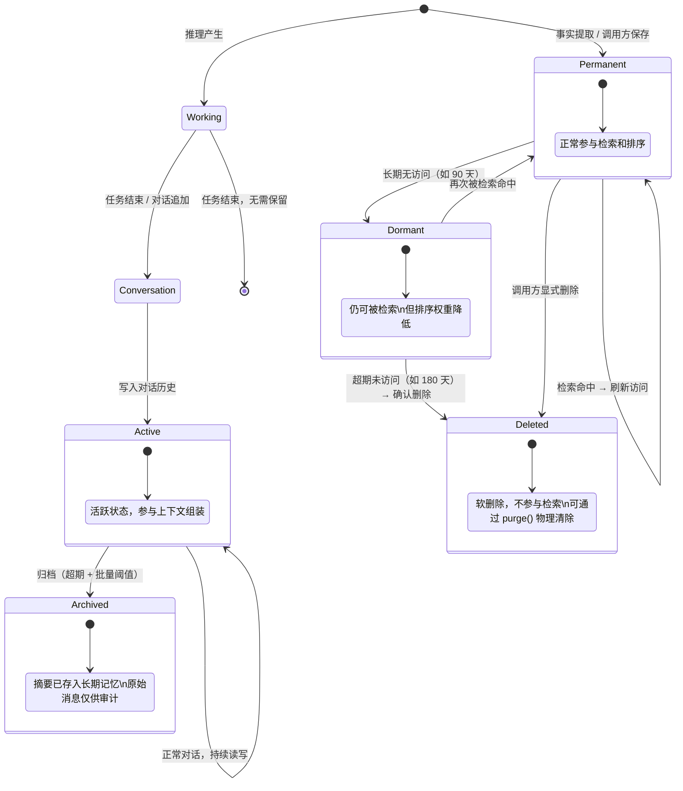
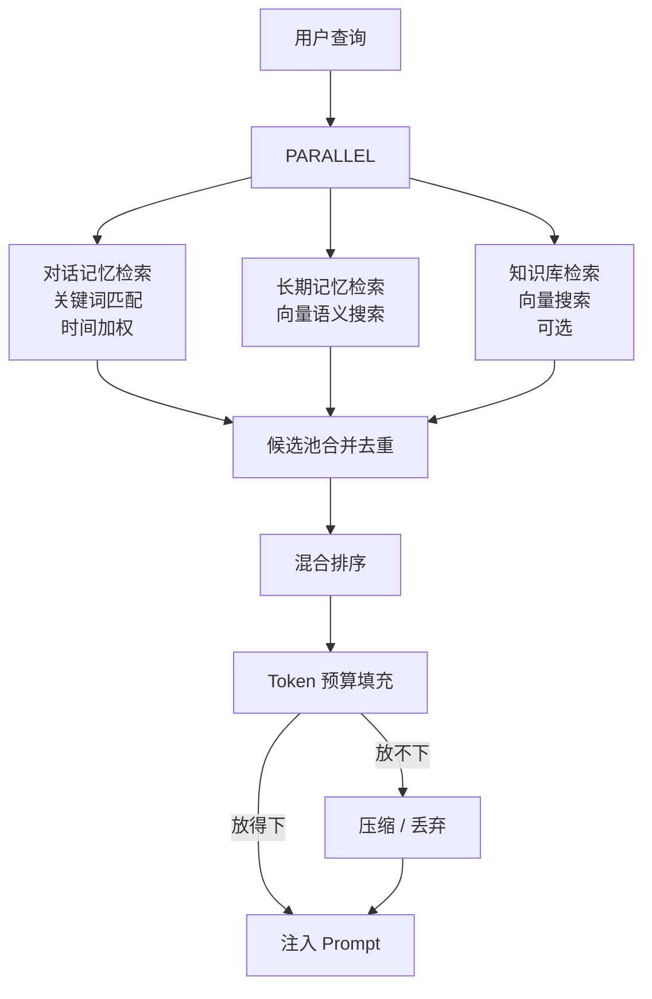

# Agent 记忆系统通用设计

## 1. 引言

### 1.1 为什么 Agent 需要记忆

大语言模型（LLM）本身是无状态的——每次请求都是一次全新的推理，无法天然记住上次对话的内容。这意味着一个没有记忆系统的 Agent：

- **无法延续上下文**：用户在第 3 轮提到"刚才那个方案"，Agent 完全不知道指什么。
- **无法积累知识**：重复问同样的问题，Agent 永远从零开始。
- **无法个性化**：不知道用户的偏好、习惯和历史决策。

记忆系统的核心价值是赋予 Agent **连续性**和**个性化能力**——让它像一个有经验的助手，而不是每次都初次见面的陌生人。

### 1.2 库定位

`agent-memory` 是一个 **TypeScript 第三方库**，供 Agent 开发者通过 `npm install` 直接集成到项目中。调用方通过工厂函数 `createMemory()` 创建实例，所有配置项均可选且有合理默认值。

**核心特征**：

- **嵌入式存储**：内置 SQLite + 本地向量索引，零外部依赖
- **单文件部署**：每个 Agent 实例的全部数据在一个目录下，拷贝即迁移
- **不绑定 LLM**：库本身不调用任何 LLM API，需要 LLM 能力时由调用方注入
- **不绑定 Embedding**：内置默认的本地 Embedding 模型，也支持注入自定义实现（OpenAI / Cohere 等）
- **CLI 支持**：内置命令行工具 `memory`，无需编写代码即可操作记忆系统

### 1.3 设计目标

| 目标 | 描述 |
|------|------|
| **零配置启动** | `createMemory()` 即可使用，所有配置项都有合理默认值 |
| **类型安全** | 完整的 TypeScript 类型定义，开发时有自动补全和编译期检查 |
| **透明性** | Agent 不需要知道底层用什么数据库、向量怎么存，只通过统一接口读写 |
| **实例独立** | 每个 Agent 拥有独立的记忆实例，多 Agent 场景下各自创建各自的实例，天然隔离 |
| **经济性** | 记忆不会全量塞进上下文窗口，而是按相关度检索、按 Token 预算裁剪 |
| **自然遗忘** | 长期不被使用的记忆逐渐降权直至清理，模拟人类遗忘曲线 |
| **可审计** | 每一条记忆的写入、访问、删除都有迹可循 |
| **可扩展** | 存储后端和 Embedding 提供者可通过接口注入替换 |

---

## 2. 记忆的分类学：人类记忆 → Agent 记忆

Agent 记忆系统的设计灵感来自认知科学对人类记忆的分类。理解这个映射关系有助于做出正确的架构决策。

### 2.1 人类记忆模型

```
┌─────────────────────────────────────────────────────────┐
│                     人类记忆系统                          │
├──────────────┬──────────────────────────────────────────┤
│  感觉记忆     │ 毫秒级，自动消退。视觉暂留、听觉回响        │
├──────────────┼──────────────────────────────────────────┤
│  工作记忆     │ 秒~分钟级，容量 7±2 项。当前正在处理的信息   │
│  (短时记忆)   │ 不主动复述就会丢失                         │
├──────────────┼──────────────────────────────────────────┤
│              │ ┌─ 情景记忆：具体事件（昨天的会议）          │
│  长时记忆     │ ├─ 语义记忆：概念性知识（Python 是编程语言） │
│              │ └─ 程序记忆：技能（骑自行车）                │
└──────────────┴──────────────────────────────────────────┘
```

### 2.2 Agent 记忆的对应

| 人类记忆 | Agent 对应 | 特征 |
|---------|-----------|------|
| 感觉记忆 | **无直接对应** | LLM 不需要感觉暂存 |
| 工作记忆 | **工作记忆（Working Memory）** | 单次推理中的中间变量、工具返回值、思维链 |
| 短时记忆 | **对话记忆（Conversation Memory）** | 当前会话的消息历史，滑动窗口管理 |
| 情景记忆 | **情景记忆（Episodic Memory）** | 具体事件：某次会话的摘要、某个决策的过程 |
| 语义记忆 | **语义记忆（Semantic Memory）** | 抽象知识：用户偏好、事实、项目信息 |
| 程序记忆 | **程序记忆（Procedural Memory）** | Agent 的 System Prompt、工具使用模式、微调权重 |
| 已有学识 | **知识库（Knowledge Base）** | 预处理好的参考文档、FAQ、领域知识，由开发者预加载 |

> **关键洞察**：人类记忆是连续体，Agent 记忆也不应该是非黑即白的"有/无"——它需要层次、过渡和筛选机制。知识库则是人类"已有学识"的对应——不是从经历中学会的，而是预先习得的参考知识。

---

## 3. 三层记忆架构

基于上述分类学，Agent 记忆系统采用三层架构，并辅以知识库作为外部参考数据源。每一层有不同的存储介质、生命周期和访问模式。



### 3.1 Layer 1：工作记忆

| 属性 | 值 |
|------|-----|
| 存储 | 调用方的进程内存（RAM） |
| 生命周期 | 单次任务 / 单次推理 |
| 作用域 | 当前执行上下文 |
| 容量 | 由可用内存决定 |

**内容**：

- ReAct / CoT 推理链中的 `Thought → Action → Observation` 序列
- 工具调用的中间 JSON 结果
- Agent 运行时的计算状态

**设计要点**：

- 库不管理工作记忆，由 Agent Runtime 自然管理
- 任务结束后自动释放
- 如果产生了有长期价值的结论，Agent 应主动调用 `saveMemory()` 写入 L3

### 3.2 Layer 2：对话记忆

| 属性 | 值 |
|------|-----|
| 存储 | 嵌入式 SQLite（默认） |
| 生命周期 | 会话级，超期后归档 |
| 作用域 | 当前 Agent 实例的会话 |
| 容量 | 受 Token 预算约束 |

**内容**：

- `user` / `assistant` / `system` 角色的原始消息
- 每条消息的 Token 计数
- 可选的任务关联、附件信息

**设计要点**：

- 类似人类对话中的"刚才说了什么"，是 Agent 维持连贯对话的基础
- 采用**滑动窗口**策略，超龄记录归档到 L3

### 3.3 Layer 3：长期记忆

| 属性 | 值 |
|------|-----|
| 存储 | 嵌入式 SQLite + 本地向量索引（默认） |
| 生命周期 | 跨会话持久存在 |
| 作用域 | 当前 Agent 实例 |
| 容量 | 受衰减策略约束 |

**子类型**：

| 子类型 | 内容示例 | 写入方式 |
|--------|---------|---------|
| **情景记忆** (episodic) | "3月15日的会话讨论了 API 重构方案" | 归档调度器自动生成摘要 |
| **语义记忆** (semantic) | "用户偏好 Vim"、"项目使用 PostgreSQL" | 事实提取器 / 调用方显式保存 |
| **程序记忆** (procedural) | Agent 的 System Prompt、行为模式 | 初始化时配置 |

**设计要点**：

- 写入时同步生成嵌入向量，实现**写入即索引**
- 每个 Agent 实例拥有自己的长期记忆存储，互不干扰
- 支持置信度评分（confidence），高置信度记忆在检索时优先

### 3.4 知识库（Knowledge Base）

| 属性 | 值 |
|------|-----|
| 存储 | 嵌入式 SQLite + 本地向量索引（默认） |
| 生命周期 | 由调用方显式管理，无衰减 |
| 作用域 | 当前 Agent 实例 |
| 容量 | 无固定上限 |

**内容**：

- 预处理好的文档分块（API 文档、产品手册、FAQ 等）
- 按来源（source）分组管理，支持整批替换

**与长期记忆的区别**：

| 维度 | 长期记忆（Memory） | 知识库（Knowledge） |
|------|---|---|
| 来源 | 对话中自动提取或显式保存 | 开发者预加载 |
| 本质 | 从经历中学到的 | 预先准备的参考资料 |
| 生命周期 | 有衰减、可遗忘 | 无衰减，显式增删 |
| 写入时机 | 运行时动态产生 | 初始化或更新时批量导入 |
| 检索标签 | `[偏好]` `[事实]` `[摘要]` | `[知识库]` |

**设计要点**：

- 每条知识块在写入时同步生成嵌入向量，与长期记忆共享同一份向量索引
- 按 `source` 字段分组，支持 `removeKnowledgeBySource()` 整批清除后重新导入
- 检索时知识库条目不参与衰减计算，重要性权重固定为基线值 0.8
- **按引用注入**：`assembleContext()` 仅将知识库的标题 + 摘要（前 120 字符）+ 引用 ID 注入上下文，不传全文，节省 Token 预算
- **按需加载全文**：LLM 通过 `knowledge_read(id)` 工具根据引用 ID 加载完整内容，实现"先概览、再深入"的检索模式

---

## 4. 记忆的生命周期

一条信息从产生到消亡，经历完整的生命周期。理解这个流程是理解系统设计决策的关键。



### 4.1 写入路径

| 触发事件 | 目标层 | 机制 |
|---------|--------|------|
| 调用 `appendMessage()` 追加用户消息 | L2 对话记忆 | 实时追加，自动计算 Token 数 |
| 调用 `appendMessage()` 追加 Agent 回复 | L2 对话记忆 | 实时追加 |
| 事实提取器检测到偏好/事实 | L3 长期记忆 | 异步提取 + 向量化写入 |
| 归档调度器生成摘要 | L3 长期记忆 | 库内部调度，LLM 生成摘要 |
| 调用方显式调用 `saveMemory()` | L3 长期记忆 | 直接写入 |

### 4.2 事实提取

事实提取是记忆系统的核心智能——自动从对话中识别值得长期记住的信息。

> **前提**：事实提取中的 LLM 模式需要调用方在创建实例时注入 `LLMProvider`。如果未注入，仅使用规则匹配模式。

**提取策略**：

```
输入：一轮对话（用户消息 + Agent 回复）
输出：零到多条结构化事实

方法一：规则匹配（低延迟、高精度、低召回）
  - "我喜欢/偏好/习惯 X" → preference
  - "项目使用/采用 X" → fact
  - "不要/别用 X" → preference

方法二：LLM 提取（高延迟、高召回、需验证）
  - 将对话发给注入的 LLMProvider，Prompt 要求提取结构化事实
  - 适合复杂、隐含的信息

推荐：规则匹配为主，LLM 为辅
```

**置信度评估**：

| 来源 | 置信度 | 处理 |
|------|--------|------|
| 调用方显式保存 | 1.0 | 直接写入 |
| 规则高度匹配 | 0.8 | 直接写入 |
| 规则模糊匹配 | 0.5 | 写入但标记需确认 |
| LLM 提取 | 0.6 | 写入但标记需确认 |

### 4.3 归档策略

归档调度器的目标是将陈旧的对话记忆压缩为精炼的长期记忆，释放上下文窗口空间。

> **前提**：归档摘要需要调用方注入 `LLMProvider`。如果未注入 LLM，归档仅做状态标记，不生成摘要。

```
┌─────────────────────────────────────────────┐
│           归档调度器工作流程                    │
├─────────────────────────────────────────────┤
│                                             │
│  触发时机：                                   │
│  ├─ 调用 assembleContext() 时自动检测         │
│  ├─ 调用 runMaintenance() 时手动触发         │
│  └─ 前提：最近 N 分钟无新消息                 │
│                                             │
│  1. 筛选候选                                 │
│     └─ 活跃对话记忆中超过时间窗口的记录         │
│     └─ 候选数需超过最小批次阈值                │
│                                             │
│  2. 批量处理（每批有上限）                     │
│     ├─ 拼接消息文本                          │
│     ├─ 调用 LLMProvider 生成 3-5 句摘要       │
│     └─ 写入长期记忆（情景记忆类别）             │
│                                             │
│  3. 标记原始记录为已归档                       │
│     └─ 保留关联指针，确保可溯源                │
└─────────────────────────────────────────────┘
```

**参考参数**（均可通过 `MemoryConfig` 配置）：

| 参数 | 配置键 | 建议默认值 | 说明 |
|------|--------|-----------|------|
| 静默检测 | `archive.quietMinutes` | 5 分钟无新消息 | 避免在活跃对话中打断 |
| 时间窗口 | `archive.windowHours` | 24 小时 | 仅归档此时间之前的记录 |
| 最小批次 | `archive.minBatch` | 5 条 | 太少不值得归档 |
| 最大批次 | `archive.maxBatch` | 20 条 | 单次归档上限，控制 LLM 调用成本 |

### 4.4 衰减与遗忘

模拟人类遗忘曲线，长时间不被访问的记忆逐渐降权：

| 阶段 | 条件 | 效果 |
|------|------|------|
| **活跃** | 近期有访问 | 正常参与检索，正常排序权重 |
| **休眠** | 创建后超过衰减周期（如 90 天）且无访问 | 仍可被检索，但排序权重降低 |
| **候选清理** | 休眠状态持续超过过期周期（如 180 天） | 触发 `onDecayWarning` 回调通知调用方 |
| **已删除** | 调用方显式删除 | 软删除（标记不可见），可通过 `purge()` 物理清除 |

> **为什么是软删除？** 防止误操作导致不可逆的数据丢失。软删除的记忆不参与任何检索，但可以在需要时恢复。

---

## 5. 检索与上下文组装

记忆的最终价值体现在"使用"——也就是将相关记忆检索出来、注入到 LLM 的上下文中。这是整个系统最关键的环节。

### 5.1 核心挑战

```
上下文窗口（如 128K tokens）是有限的：
  System Prompt:   ~2K tokens（必须保留）
  用户输入:        ~1K tokens（必须保留）
  输出预留:        ~1K tokens（必须保留）
  ─────────────────────────────
  记忆预算:        ~124K tokens（看似很多）

但实际上：
  活跃对话记忆:     可能有 500 条消息
  长期记忆:         可能有上千条事实
  知识库文档:       可能有数万个分块

  ⇒ 无法全部塞入。必须检索 + 裁剪。
```

### 5.2 混合检索策略



**各阶段详解**：

#### 阶段一：并行检索

| 数据源 | 检索方法 | 注入方式 |
|--------|---------|----------|
| 对话记忆 | 关键词匹配 + 时间权重 | 原文片段 |
| 长期记忆 | 向量余弦相似度 | 原文 |
| 知识库 | 向量余弦相似度 | **仅标题 + 摘要 + 引用 ID**，LLM 按需通过 `knowledge_read` 工具加载全文 |

#### 阶段二：混合排序

```
排序函数 = f(relevance, recency, importance)

其中：
  relevance  = 向量相似度 或 关键词匹配分数（0-1）
  recency    = 时间衰减因子（越近越高）
  importance = 记忆的重要性权重（置信度 × 访问频率）

排序规则：
  1. relevance 差异 > 阈值（如 0.05）时，按 relevance 降序
  2. relevance 相近时，按 recency 降序
  3. 同等条件下，按 importance 降序
```

#### 阶段三：Token 预算填充

```
可用预算 = 模型上下文窗口 - (System Prompt + 用户输入 + 输出预留)

填充策略（贪心法）：
  按排序逐条尝试放入
   ├─ 放得下 → 直接加入
   ├─ 放不下但有摘要版本 → 用摘要替代
   ├─ 放不下且是长文本 → 实时 LLM 压缩后再试
   └─ 实在放不下 → 跳过
```

### 5.3 注入格式

检索到的记忆需要以结构化格式注入 Prompt，让 LLM 能理解每条信息的性质和来源：

```
<MEMORY>
[对话历史] 2小时前用户提到需要改进错误处理
[偏好] 偏好 TypeScript + React 技术栈
[事实] Project Alpha 采用 PostgreSQL + gRPC
[摘要] 3月的讨论结论：API 采用 RESTful 风格
[知识库·api-docs] Authentication — 所有 API 请求需携带 Bearer Token… (ref:kb_1711929600_a3f)
[知识库·api-docs] Rate Limiting — 每个 API Key 限制 1000 次/分钟… (ref:kb_1711929601_b4e)
[压缩] （原文过长已压缩）上周评审了监控方案，决定用 Prometheus
</MEMORY>
```

> **知识库按引用注入**：知识库内容不直接传全文给 LLM，仅注入标题 + 摘要（前 120 字符）+ 引用 ID。LLM 可通过 `knowledge_read(id)` 工具按需加载全文。这样既节省上下文窗口，又让 LLM 知道有哪些知识可用。

**标签约定**：

| 标签 | 来源 | 说明 |
|------|------|------|
| `[对话历史]` | L2 对话记忆 | 活跃消息原文片段 |
| `[偏好]` / `[事实]` / `[项目]` | L3 语义记忆 | 标注具体分类 |
| `[摘要]` | L3 情景记忆 | 归档生成的会话摘要 |
| `[知识库·{source}]` | 知识库 | 标题 + 摘要 + 引用 ID，`ref:kb_xxx` 可通过 `knowledge_read` 工具获取全文 |
| `[压缩]` | 任意来源 | 因预算不足而实时压缩的内容 |

---

## 6. 实例模型：一个 Agent，一份记忆

记忆系统为**单个 Agent** 设计。每个 Agent 拥有自己独立的记忆实例，包含完整的对话记忆和长期记忆存储。

### 6.1 核心原则

```
┌─────────────────────────────────────────────────────┐
│           单 Agent 记忆实例                           │
├─────────────────────────────────────────────────────┤
│                                                     │
│  ┌───────────────────────────────────────────┐       │
│  │  Layer 2: 对话记忆                         │       │
│  │  (本 Agent 的对话历史)                     │       │
│  └───────────────────────────────────────────┘       │
│                                                     │
│  ┌───────────────────────────────────────────┐       │
│  │  Layer 3: 长期记忆                         │       │
│  │  偏好 / 事实 / 摘要 / 程序记忆             │       │
│  └───────────────────────────────────────────┘       │
│                                                     │
│  ┌───────────────────────────────────────────┐       │
│  │  知识库                                    │       │
│  │  预加载的文档分块 / FAQ / 领域知识          │       │
│  └───────────────────────────────────────────┘       │
│                                                     │
│  ┌───────────────────────────────────────────┐       │
│  │  向量索引                                  │       │
│  │  (长期记忆 + 知识库 共享)                  │       │
│  └───────────────────────────────────────────┘       │
│                                                     │
└─────────────────────────────────────────────────────┘
```

### 6.2 多 Agent 场景

如果应用中有多个 Agent，每个 Agent 各自创建一个记忆实例，通过配置不同的 `dataDir` 实现物理隔离。

```
Agent A  ──→  createMemory({ dataDir: './data/agent-a' })  ──→  独立数据目录 A
Agent B  ──→  createMemory({ dataDir: './data/agent-b' })  ──→  独立数据目录 B
Agent C  ──→  createMemory({ dataDir: './data/agent-c' })  ──→  独立数据目录 C
```

**隔离方式**：

| 方案 | 说明 | 适用场景 |
|------|------|--------|
| **独立数据目录**（默认） | 每个实例使用独立的 SQLite 文件和向量索引目录 | 强隔离、最简单 |
| **自定义 StorageProvider** | 实现存储接口，自行决定隔离策略 | 高级场景 |

> **推荐方案**：优先使用独立数据库文件，隔离最彻底，无需担心查询遗漏过滤条件。

### 6.3 Agent 间信息传递

由于每个 Agent 的记忆是完全独立的，Agent 之间不能直接读取彼此的记忆。需要传递信息时，由上层应用负责协调：

| 场景 | 机制 |
|------|------|
| Agent A 的结论需要传递给 Agent B | 上层应用将 A 的输出作为 B 的输入，通过 `appendMessage()` 写入 B 的对话记忆 |
| 多个 Agent 需要共享某些事实 | 上层应用在创建各 Agent 实例时，通过 `saveMemory()` 向各自的记忆中写入相同的初始事实 |
| 协作场景 | 上层应用维护共享消息总线，各 Agent 通过总线通信而非直接访问对方记忆 |

> **原则**：记忆库只管好“自己的事”。跨 Agent 协调是上层应用的职责，不是记忆库需要解决的问题。

---

## 7. 统一记忆接口

所有 Agent 通过统一接口操作记忆，**禁止绕过接口直接读写存储**。这是保证审计、一致性的基础。

### 7.1 初始化配置（MemoryConfig）

创建实例时可通过配置对象控制行为，所有字段可选，均有合理默认值：

| 配置项 | 类型 | 默认值 | 说明 |
|--------|------|--------|------|
| `dataDir` | 字符串 | `process.env.AGENT_MEMORY_DATA_DIR \|\| './agent-memory-data'` | 数据存储目录路径。优先读取环境变量 `AGENT_MEMORY_DATA_DIR`，未设置时回退到 `'./agent-memory-data'` |
| `embedding` | EmbeddingProvider | 内置本地模型 | Embedding 提供者接口 |
| `llm` | LLMProvider | 无（禁用摘要/提取） | LLM 提供者，用于归档摘要和事实提取 |
| `tokenBudget.contextWindow` | 整数 | 128000 | 模型上下文窗口总大小 |
| `tokenBudget.systemPromptReserve` | 整数 | 2000 | System Prompt 预留 Token 数 |
| `tokenBudget.outputReserve` | 整数 | 1000 | 输出预留 Token 数 |
| `archive.quietMinutes` | 整数 | 5 | 静默期（分钟），避免在活跃对话中归档 |
| `archive.windowHours` | 整数 | 24 | 仅归档此时间之前的记录 |
| `archive.minBatch` | 整数 | 5 | 最小归档批次 |
| `archive.maxBatch` | 整数 | 20 | 最大归档批次 |
| `decay.dormantAfterDays` | 整数 | 90 | 进入休眠的天数 |
| `decay.expireAfterDays` | 整数 | 180 | 候选清理的天数 |
| `limits.maxConversationMessages` | 整数 | 500 | 活跃对话记忆最大条数 |
| `limits.maxLongTermMemories` | 整数 | 1000 | 长期记忆最大条数 |

### 7.2 外部提供者接口

库需要两个可选的外部能力注入：

**EmbeddingProvider**（向量嵌入）：

| 属性/方法 | 说明 |
|-----------|------|
| `dimensions` | 向量维度（如 384 / 768 / 1536） |
| `embed(text) → number[]` | 将文本转换为嵌入向量 |

**LLMProvider**（大模型调用，用于归档摘要和事实提取）：

| 属性/方法 | 说明 |
|-----------|------|
| `generate(prompt) → string` | 给定 prompt，返回 LLM 生成的文本 |

> 如果不注入 EmbeddingProvider，库使用内置本地模型。如果不注入 LLMProvider，归档仅做状态标记不生成摘要，事实提取仅使用规则匹配。

### 7.3 核心数据类型

**Message**（对话消息）：

| 字段 | 类型 | 说明 |
|------|------|------|
| `id` | 整数 | 自增主键 |
| `role` | `'user'` / `'assistant'` / `'system'` | 角色 |
| `content` | 字符串 | 消息内容 |
| `tokenCount` | 整数 | Token 计数 |
| `metadata` | 键值对（可选） | 扩展元数据 |
| `createdAt` | Unix 毫秒时间戳 | 创建时间 |

**MemoryItem**（长期记忆条目）：

| 字段 | 类型 | 说明 |
|------|------|------|
| `id` | 字符串 | 如 `ltm_{timestamp}_{random}` |
| `category` | `'preference'` / `'fact'` / `'episodic'` / `'procedural'` | 记忆分类 |
| `key` | 字符串 | 标题 / 索引键 |
| `value` | 字符串 | 记忆正文 |
| `confidence` | 0-1 浮点数 | 置信度 |
| `accessCount` | 整数 | 访问次数 |
| `lastAccessed` | Unix 毫秒时间戳（可空） | 最后访问时间 |
| `isActive` | 布尔 | 是否活跃（软删除标记） |
| `createdAt` | Unix 毫秒时间戳 | 创建时间 |

**AssembledContext**（组装后的上下文）：

| 字段 | 类型 | 说明 |
|------|------|------|
| `text` | 字符串 | 可直接拼入 Prompt 的格式化文本 |
| `tokenCount` | 整数 | 使用的 Token 数 |
| `sources` | 来源数组 | 检索到的来源条目（类型为 `'conversation'` / `'memory'` / `'knowledge'`、ID、相关度分数），用于调试/审计 |

**KnowledgeChunk**（知识库条目）：

| 字段 | 类型 | 说明 |
|------|------|------|
| `id` | 字符串 | 如 `kb_{timestamp}_{random}` |
| `source` | 字符串 | 来源标识（如 `'api-docs'`、`'faq'`） |
| `title` | 字符串 | 标题 |
| `content` | 字符串 | 内容正文 |
| `tokenCount` | 整数 | Token 计数 |
| `metadata` | 键值对（可选） | 扩展元数据 |
| `createdAt` | Unix 毫秒时间戳 | 创建时间 |

### 7.4 主接口方法

#### 读取

| 方法 | 返回 | 说明 |
|------|------|------|
| `getConversationHistory(limit?)` | Message 列表 | 获取最近活跃（未归档）对话记忆，按时间正序 |
| `searchMemory(query, topK?)` | 带分数的 MemoryItem 列表 | 在长期记忆中语义检索，自动刷新命中记忆的访问时间 |
| `assembleContext(query, tokenBudget?)` | AssembledContext | 一站式上下文组装：并行检索（对话 + 长期记忆 + 知识库）→ 排序 → 预算裁剪 → 格式化。可选传入 `tokenBudget` 覆盖本次调用的 Token 预算配置。调用时自动检测是否需要触发归档 |

#### 写入

| 方法 | 返回 | 说明 |
|------|------|------|
| `appendMessage(role, content, metadata?)` | 消息 ID | 追加一条对话消息，自动计算 Token 数 |
| `saveMemory(category, key, value, confidence?)` | 记忆 ID | 写入长期记忆。原子操作：生成 ID → 写数据库 → 生成嵌入向量 → 写向量索引 |

#### 知识库

| 方法 | 返回 | 说明 |
|------|------|------|
| `addKnowledge(source, title, content, metadata?)` | 知识块 ID | 添加一条知识块，写入即向量化 |
| `addKnowledgeBatch(chunks)` | ID 数组 | 批量添加知识块 |
| `removeKnowledge(id)` | 无 | 删除单条知识块（物理删除） |
| `removeKnowledgeBySource(source)` | 删除条数 | 删除指定来源的全部知识块，适用于整批更新 |
| `listKnowledge(source?)` | KnowledgeChunk 列表 | 列出知识块，可按来源过滤 |
| `searchKnowledge(query, topK?)` | 带分数的 KnowledgeChunk 列表 | 在知识库中语义检索 |

#### 管理

| 方法 | 返回 | 说明 |
|------|------|------|
| `deleteMemory(id)` | 无 | 软删除：标记不可见 + 清除对应向量，不物理删除 |
| `listMemories(filter?)` | MemoryItem 列表 | 列出记忆条目，支持按分类、状态、时间范围过滤 |
| `refreshAccess(id)` | 无 | 访问计数 +1，最后访问时间更新为当前时间 |

#### 配置

| 方法 | 返回 | 说明 |
|------|------|------|
| `updateTokenBudget(budget)` | 无 | 动态更新 Token 预算配置（可部分更新），下次 `assembleContext()` 调用生效 |

#### LLM 工具集成

| 方法 | 返回 | 说明 |
|------|------|------|
| `getToolDefinitions(format)` | 工具定义数组 | 获取记忆工具的 Function/Tool 定义，支持 `'openai'` / `'anthropic'` / `'langchain'` 格式 |
| `executeTool(name, args)` | 执行结果 | 在 Agent 的 tool call handler 中执行记忆工具调用 |

#### 运维

| 方法 | 返回 | 说明 |
|------|------|------|
| `getStats()` | MemoryStats | 各类记忆数量统计、存储大小 |
| `listConversations(offset?, limit?)` | Message 列表 | 分页查询对话历史（含已归档） |
| `runMaintenance()` | MaintenanceResult | 手动触发归档 + 衰减检测（也可由 `assembleContext()` 自动懒触发） |
| `export()` | JSON 数据 | 导出全部记忆数据 |
| `import(data)` | 无 | 从导出数据恢复记忆 |
| `purge()` | 清除条数 | 物理删除所有软删除的记忆（不可逆） |
| `close()` | 无 | 释放 SQLite 连接和向量索引资源。关闭后不可再调用其他方法 |

### 7.5 接口行为约定

| 方法 | 关键行为 |
|------|---------|
| `getConversationHistory` | 仅返回活跃（未归档）记录，按时间正序排列 |
| `searchMemory` | 在当前实例的长期记忆中进行向量语义检索，自动刷新命中记忆的访问时间 |
| `assembleContext` | 并行执行对话检索 + 长期记忆检索 + 知识库检索 → 混合排序 → Token 预算裁剪 → 返回可直接拼入 Prompt 的文本。支持可选的 `tokenBudget` 参数，未指定的字段回退到实例级配置 |
| `appendMessage` | 自动计算 `tokenCount`；可选关联任务 ID、附件 |
| `saveMemory` | 原子操作：生成 ID → 写 SQLite → 生成嵌入向量 → 写向量索引 |
| `deleteMemory` | 软删除：标记不可见 + 清除对应向量，不物理删除 |
| `close` | 关闭后调用任何方法将抛出 `MemoryClosedError` |

**错误类型层次**：

| 错误类型 | 触发场景 |
|---------|---------|
| `MemoryError` | 所有记忆操作错误的基类 |
| `MemoryClosedError` | 实例已关闭后仍调用方法 |
| `MemoryNotFoundError` | 操作的记忆 ID 不存在 |
| `MemoryCapacityError` | 超出容量限制 |
| `EmbeddingError` | 向量嵌入生成失败 |

### 7.6 Agent 集成流程

Agent 执行一次任务的典型流程：

```
① assembleContext(用户输入)
   → 三路并行检索（对话记忆 + 长期记忆 + 知识库）
   → 混合排序 → Token 预算裁剪 → 格式化为上下文文本
   （可选传入 tokenBudget 覆盖本次预算配置）

② 构建 Prompt = System Prompt + 记忆上下文 + 用户输入
   → 调用 LLM 生成回复

③ appendMessage('assistant', 回复内容)
   → 将回复存入对话记忆

④ （异步）事实提取器分析本轮对话
   → 如发现偏好/事实，调用 saveMemory() 存入长期记忆

⑤ 如 LLM 返回 tool calls（记忆工具），通过 executeTool() 执行
```

---

## 8. 存储模型（内部实现）

> 以下是库的内部存储结构，调用方无需关心。仅供理解实现和调试使用。

### 8.1 数据目录结构

```
{dataDir}/
├── memory.db          # SQLite 数据库（对话记忆 + 长期记忆 + 知识库）
├── vectors/           # 本地向量索引文件
│   ├── index.bin      # HNSW 索引（长期记忆 + 知识库共享）
│   └── meta.json      # ID 映射元数据
└── audit.log          # 审计日志
```

### 8.2 对话记忆表

| 字段 | 类型 | 说明 |
|------|------|------|
| `id` | 自增整数 | 主键 |
| `role` | 字符串 | `'user'` / `'assistant'` / `'system'` |
| `content` | 字符串 | 消息内容 |
| `token_count` | 整数 | Token 计数 |
| `attachments` | JSON（可空） | 附件描述 |
| `related_task_id` | 字符串（可空） | 关联任务 ID |
| `metadata` | JSON（可空） | 扩展元数据 |
| `summary` | 字符串（可空） | 归档时生成的摘要 |
| `importance` | 浮点数 | 重要性权重，默认 0.5 |
| `is_archived` | 布尔 | 0=活跃, 1=已归档 |
| `ltm_ref_id` | 字符串（可空） | 归档后指向长期记忆的 ID |
| `created_at` | Unix 毫秒时间戳 | 创建时间 |

索引：`(is_archived, created_at)` 联合索引，加速活跃记录按时间查询。

### 8.3 长期记忆表

| 字段 | 类型 | 说明 |
|------|------|------|
| `id` | 字符串 | 主键，如 `ltm_{timestamp}_{random}` |
| `category` | 字符串 | `'preference'` / `'fact'` / `'episodic'` / `'procedural'` |
| `key` | 字符串 | 标题 / 索引键 |
| `value` | 字符串 | 记忆正文 |
| `embedding_id` | 字符串 | 向量索引中的 ID |
| `confidence` | 浮点数 | 0-1 置信度，默认 0.7 |
| `access_count` | 整数 | 访问次数，默认 0 |
| `last_accessed` | Unix 毫秒时间戳（可空） | 最后访问时间 |
| `is_active` | 布尔 | 1=活跃, 0=软删除 |
| `created_at` | Unix 毫秒时间戳 | 创建时间 |

索引：`(is_active)` 索引，加速活跃记忆查询。

### 8.4 知识库表

| 字段 | 类型 | 说明 |
|------|------|------|
| `id` | 字符串 | 主键，如 `kb_{timestamp}_{random}` |
| `source` | 字符串 | 来源标识（如 `'api-docs'`、`'faq'`） |
| `title` | 字符串 | 标题 |
| `content` | 字符串 | 内容正文 |
| `embedding_id` | 字符串 | 向量索引中的 ID |
| `token_count` | 整数 | Token 计数 |
| `metadata` | JSON（可空） | 扩展元数据 |
| `created_at` | Unix 毫秒时间戳 | 创建时间 |

索引：`(source)` 索引，加速按来源查询和批量删除。

### 8.5 向量索引

| 字段 | 类型 | 说明 |
|------|------|------|
| `vector` | `Float32[dim]` | 嵌入向量（维度取决于 EmbeddingProvider，如 384 / 768 / 1536） |
| `text` | `String` | 原始文本或摘要 |
| `metadata.source_type` | `String` | `'memory'` / `'knowledge'` / `'episodic'` |
| `metadata.category` | `String` | 记忆分类 |
| `metadata.source_id` | `String` | 关联 `long_term_memory.id` |
| `metadata.created_at` | `Int64` | 创建时间戳 |

> 库默认使用嵌入式 HNSW 向量索引（如 [hnswlib-node](https://github.com/yoshoku/hnswlib-node)），无需外部向量数据库。每个实例独立一份索引文件。

---

## 9. Embedding 提供者

### 9.1 接口设计

EmbeddingProvider 接口包含两个能力：

| 属性/方法 | 说明 |
|-----------|------|
| `dimensions` | 向量维度（如 384 / 768 / 1536） |
| `embed(text) → number[]` | 将文本转换为嵌入向量 |

### 9.2 内置默认实现

如果调用方不注入 `EmbeddingProvider`，库默认使用本地模型（基于 `@xenova/transformers`，ONNX Runtime 推理）：

- **模型**：`all-MiniLM-L6-v2`（384 维，约 80MB）
- **优势**：无需 API Key、无网络请求、数据完全本地
- **首次使用**：自动下载模型到 `{dataDir}/models/`，后续读缓存

### 9.3 自定义注入

调用方可注入任意实现了 EmbeddingProvider 接口的对象，包括但不限于：

| 提供商 | 典型维度 | 说明 |
|---------|---------|------|
| OpenAI (`text-embedding-3-small`) | 1536 | 调用 OpenAI Embeddings API |
| Cohere (`embed-english-v3.0`) | 1024 | 调用 Cohere Embed API |
| Ollama (`nomic-embed-text`) | 768 | 本地 Ollama 实例 |
| 其他自定义模型 | 自定义 | 任何能返回固定维度向量的实现 |

---

## 10. 导出 LLM 工具定义

当 Agent 使用 Function Calling / Tool Use 模式时，记忆库可以将记忆操作以工具的形式导出，让 LLM 在对话中主动管理自己的记忆。

### 10.1 工具清单

| 工具名 | 参数 | 作用 | 权限 |
|--------|------|------|------|
| `memory_search` | `{ query, topK? }` | 在长期记忆中语义检索 | 自动 |
| `memory_save` | `{ category, key, value }` | 保存事实/偏好到长期记忆 | 自动 |
| `memory_list` | `{ category? }` | 列出活跃记忆条目 | 自动 |
| `memory_delete` | `{ id }` | 软删除指定记忆 | 需确认 |
| `memory_get_history` | `{ limit? }` | 获取最近 N 条对话消息 | 自动 |
| `knowledge_read` | `{ id }` | 根据引用 ID 读取知识块全文。当上下文中出现 `ref:kb_xxx` 引用且 LLM 需要详细内容时调用 | 自动 |
| `knowledge_search` | `{ query, topK? }` | 在知识库中语义检索，返回标题 + 摘要 + 引用 ID（不含全文） | 自动 |

### 10.2 工具导出机制

库通过 `getToolDefinitions(format)` 方法导出工具定义，返回的格式可直接传给对应的 LLM SDK。调用 `executeTool(name, args)` 在 Agent 的 tool call handler 中执行。

支持的导出格式：

| 格式 | 兼容 SDK |
|------|--------|
| `'openai'` | OpenAI SDK / Vercel AI SDK |
| `'anthropic'` | Anthropic SDK |
| `'langchain'` | LangChain / LangGraph |

### 10.3 安全约定

| 约定 | 说明 |
|------|------|
| **实例绑定** | 工具操作的都是当前 Agent 实例自己的记忆，LLM 无需也无法指定目标 |
| **删除需确认** | `memory_delete` 的 `executeTool` 默认返回确认提示而非直接删除，调用方可通过配置跳过确认 |
| **写入内容清洗** | 写入前过滤特殊控制符号、截断超长内容、拦截敏感信息（密码/密钥） |
| **审计日志** | 所有写入和删除操作写入本地审计日志文件 |

---

## 11. 安全设计

| 威胁类型 | 攻击场景 | 防御措施 |
|---------|---------|---------|
| **记忆投毒 (Prompt Injection)** | 攻击者通过对话注入恶意指令，被存入长期记忆 | 写入前文本清洗：移除控制标记、过滤可疑指令模式 |
| **敏感信息泄露** | 对话中无意提到的 API Key / 密码被存入记忆 | 事实提取管道配置敏感信息正则拦截，匹配到则记录告警但不存入 |
| **记忆篡改** | LLM 被诱导调用 `memory_save` 覆盖关键事实 | 重要事实增加 `immutable` 标记；覆盖操作需用户确认 |
| **存储膨胀** | 大量写入导致磁盘占用持续增长 | 记忆数量上限（`limits.maxConversationMessages` / `limits.maxLongTermMemories`）、存储容量监控告警 |
| **误删** | Agent 或调用方误删关键记忆 | 只做软删除，物理删除需显式调用 `purge()` |
| **审计需求** | 需要追踪什么时候写入/删除了什么 | 所有变更操作写入审计日志：时间、操作类型、内容摘要 |

---

## 12. 容量监控与运维

### 12.1 容量监控

库通过 `getStats()` 方法暴露统计信息（包括各类记忆数量、存储大小等），调用方可按需检查。

**统计信息包含**：

| 指标组 | 字段 | 说明 |
|---------|------|------|
| 对话记忆 | 活跃数 / 已归档数 | 分别统计未归档和已归档的消息条数 |
| 长期记忆 | 活跃数 / 休眠数 / 已删除数 | 各状态的记忆条数 |
| 知识库 | 知识块数 / 来源数 | 知识库的分块总数和独立来源数 |
| 存储大小 | SQLite 字节数 / 向量索引字节数 | 磁盘占用 |

**建议监控阈值**：

| 指标 | 建议阈值 | 处理 |
|------|---------|------|
| 活跃对话记忆条数 | > 500 | 调用 `runMaintenance()` 触发归档 |
| 长期记忆条数 | > 1000 | 调用 `listMemories()` 清理低频条目 |
| 向量索引占用 | > 1 GB | 调用 `purge()` 清理已删除向量 |
| 休眠记忆数量 | > 100 | 清理过期条目 |

### 12.2 维护操作

| 操作 | 方法 | 说明 |
|------|------|------|
| 手动触发归档 + 衰减检测 | `runMaintenance()` | 返回归档条数、休眠条数、摘要生成数 |
| 导出全部数据 | `export()` | JSON 格式，用于备份/迁移 |
| 从备份恢复 | `import(data)` | 从导出数据恢复记忆 |
| 物理清除软删除记忆 | `purge()` | 不可逆操作，返回清除条数 |
| 优雅关闭 | `close()` | 释放 SQLite 连接和向量索引资源 |

---

## 13. 命令行工具（CLI）

库内置命令行工具 `memory`，安装后可直接在终端操作记忆系统，无需编写代码。适用于调试、数据管理和快速验证。

### 13.1 安装与使用

```bash
# 全局安装
npm install -g agent-memory

# 或直接通过 npx 执行
npx memory <command>
```

### 13.2 全局选项

| 选项 | 说明 |
|------|------|
| `--data-dir <path>` | 指定数据目录。优先级：`--data-dir` > `$AGENT_MEMORY_DATA_DIR` > `./memory-data` |

### 13.3 命令一览

#### 对话记忆

| 命令 | 说明 | 示例 |
|------|------|------|
| `append <role> <content>` | 追加消息（role: user/assistant/system） | `memory append user "你好"` |
| `history [--limit N]` | 查看最近对话历史 | `memory history --limit 10` |

#### 长期记忆

| 命令 | 说明 | 示例 |
|------|------|------|
| `save <category> <key> <value>` | 保存记忆（可选 `--confidence`） | `memory save preference lang TypeScript` |
| `search <query> [--top-k N]` | 语义搜索长期记忆 | `memory search "用户偏好"` |
| `list [--category <cat>]` | 列出记忆条目 | `memory list --category fact` |
| `delete <id>` | 软删除记忆 | `memory delete ltm_xxx` |

#### 知识库

| 命令 | 说明 | 示例 |
|------|------|------|
| `kb-add --source <s> --title <t> [--file <path>] [content]` | 添加知识块 | `memory kb-add --source api --title Auth --file auth.md` |
| `kb-list [--source <s>]` | 列出知识块 | `memory kb-list --source api` |
| `kb-search <query> [--top-k N]` | 搜索知识库 | `memory kb-search "认证方式"` |
| `kb-remove <id>` 或 `--source <s>` | 删除知识块或整批删除 | `memory kb-remove --source api` |

#### 上下文组装

| 命令 | 说明 | 示例 |
|------|------|------|
| `context <query>` | 三路检索 + 排序 + 预算裁剪，输出可注入 Prompt 的文本 | `memory context "项目架构"` |

#### 运维

| 命令 | 说明 | 示例 |
|------|------|------|
| `stats` | 查看记忆统计信息 | `memory stats` |
| `maintenance` | 手动触发归档 + 衰减检测 | `memory maintenance` |
| `export [--output <file>]` | 导出全部数据为 JSON | `memory export --output backup.json` |
| `import <file>` | 从 JSON 文件恢复数据 | `memory import backup.json` |
| `purge` | 物理删除已软删除的记忆（交互式确认） | `memory purge` |

---

## 14. 设计决策与权衡

| 决策 | 选择 | 替代方案 | 理由 |
|------|------|---------|------|
| **库而非服务** | ✅ npm 包，嵌入式使用 | 独立微服务 + HTTP 接口 | 零部署成本、零运维，Agent 开发者 `npm install` 即用 |
| **嵌入式存储** | ✅ SQLite + 本地向量索引 | PostgreSQL + Milvus 等外部存储 | 零外部依赖、单目录部署、拷贝即迁移 |
| **Factory 函数** | ✅ `createMemory()` | Class 构造器 `new Memory()` | 隐藏内部实现细节，异步初始化更自然，便于未来替换内部实现 |
| **全异步 API** | ✅ 所有方法返回 Promise | 提供同步版本 | IO 操作天然异步，统一风格避免混淆 |
| **不绑定 LLM** | ✅ 通过 `LLMProvider` 注入 | 内置 OpenAI 调用 | 保持库的通用性，调用方控制 LLM 选型和成本 |
| 单实例模型 | ✅ | 多 Agent 共享存储 + agent_id 隔离 | 简单、隔离彻底、无过滤遗漏风险 |
| 写入即向量化 | ✅ | 异步批量向量化 | 避免查询时发现未索引的记忆，保证一致性 |
| 软删除优先 | ✅ | 直接物理删除 | 安全第一，误删可恢复。`purge()` 提供显式物理删除 |
| 规则+LLM 双模式提取 | ✅ | 纯 LLM 提取 | 规则匹配快速可靠，LLM 提取作为补充 |
| 混合检索（关键词+向量） | ✅ | 纯向量检索 | 对话记忆中关键词匹配有时比语义搜索更精确 |
| Token 预算贪心填充 | ✅ | 最优背包算法 | 贪心法简单高效，实际效果差异不大 |
| 渐进衰减而非定期清理 | ✅ | 固定过期时间 | 模拟自然遗忘，常用记忆不会被误清 |
| **知识库与记忆分离** | ✅ 独立表 + 共享向量索引 | 统一存入长期记忆 | 知识库是静态参考数据，无需衰减/置信度；独立管理支持整批替换 |
| **Token 预算动态可调** | ✅ `updateTokenBudget()` + 按次覆盖 | 仅初始化时配置 | 不同模型/场景需要不同预算，运行时切换更灵活 |

---

## 15. 总结

`agent-memory` 的本质是在 LLM 的无状态推理之上构建**有状态的持续能力**，并将其封装为一个开箱即用的 TypeScript 库。核心设计思路可以概括为：

1. **零配置启动**：`npm install` + `createMemory()` 即可使用，所有配置可选
2. **三层分离**：工作记忆（瞬时）→ 对话记忆（会话级）→ 长期记忆（永久），各层有独立的生命周期和管理策略
3. **知识库支持**：内置知识库作为预处理好的参考数据源，与动态记忆互补，按来源分组、整批可替换
4. **单实例模型**：一个 Agent 一份记忆实例，多 Agent 各自创建独立实例，隔离彻底且实现简单
5. **写入即索引**：存储和向量化是原子操作，不存在"已存储但未索引"的中间状态
6. **三路检索**：对话记忆（关键词）+ 长期记忆（向量）+ 知识库（向量）并行检索，混合排序后按 Token 预算裁剪
7. **预算动态可调**：Token 预算支持实例级更新和按次覆盖，适配不同模型和场景
8. **自然遗忘**：过时的记忆不会突然消失，而是逐渐降权、最终清理（知识库不参与衰减）
9. **不绑定依赖**：不绑定具体的 LLM 或 Embedding 提供商，通过接口注入保持通用性
10. **安全纵深**：内容清洗 + 审计日志 + 软删除，多层防线
11. **CLI 工具**：内置 `memory` 命令行，无需编写代码即可操作记忆系统，便于调试和数据管理
